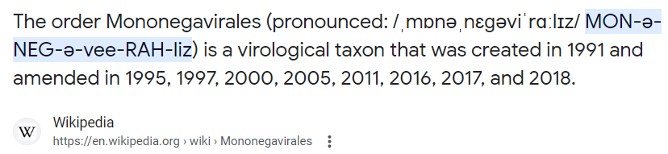
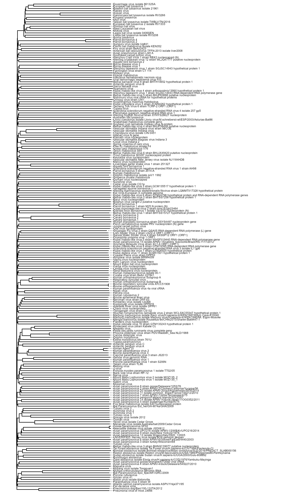

## Project Aim 
 <font size="3">The aim of this project is to construct a phylogenetic tree of viruses in the order Mononegavirales based on differentiation in their complete genomic sequences obtained from Genbank. The tree will visually iterate the evolutionary relationships between viruses in this large order, including those viruses in several important families whose members are known to be pathogenic to humans. Some such families under the order Mononegavirales are Filoviridae (contains Ebola virus), Rhabdoviridae (includes Rabies virus), and Paromixoviridae (contains Measles and Mumps viruses). <font>


## Order Mononegavirales 
 <font size="3">If you didn't think english could get any harder... there's Latin<font>
```{r,echo=FALSE, out.height=200, out.width=800}

```

 <font size="3"> And if you still don't understand how to say this word (how could you not?!) here's something to confuse you a little bit more!<font>


<iframe width="560" height="315" src="https://www.youtube.com/embed/EXfB2YCeTDI?start=2" frameborder="0" allowfullscreen data-external="1">
</iframe>
### Background Information
 <font size="3"> Mononegavirales are an order of single stranded negative sense RNA viruses comprising 11 virus families of which many members are capable of causing significant human disease (or disease of vertebrate animalia). These viruses consist of non segmented genomes ranging from 8-20KB in length (8,00 - 20,000 base pairs or about 3,00-7,00 amino acids). Most viruses of the order Mononegavirales replicate in host-cell cytoplasm (with the exception of certain Bornaviruses which replicate in the nuclei), and once abundant in the host body can attack the immune, nervous, excretory, and other major organ systems causing a vast range of symptoms with varied severity. It is important to note that not all Mononegavirus infections are symptomatic, or severe.  Some examples of Mononegavirales capable of causing infection in humans are Nipah virus, Ebola, Rabies virus, Measles virus and Mumps virus.</font>
 

### Project Importance 
 <font size="3"> Understanding the evolutionary relationships of viruses especially those causing the pathogenesis of high mortality and morbidity diseases is exceedingly important to the preservation of public health, especially in underdeveloped countries where bio surveillance programs and methods are not as strong or advanced as those in other nations. Tracking species divergence as a result of viromic evolution including genomic mutation over time can help scientists and public health officials to create vaccines, predict local, province, and national epidemics or even pandemics, determine host ranges, and develop effective antivirals and treatments for existing infectious strains as well as potentially related or derived strains. Phylogenetic trees quantitatively represent these evolutionary relationships of specific viral taxa based on genome differentiation as a hypothesis of species divergence over time. These trees explain vast amounts of genomic data in an easy to understand format for scientists and the everyday person alike.<font>
 
## Project Methods 
 <font size="3"> To communicate my final project I will detail how I went about constructing the phylogenetic tree which I built based on the complete genomic sequences of 220 virus isolates in the order Mononegavirales obtained from Genbank <font>
 
### Step 1: Acquire and Load R Packages To Import and Manipulate Genomic Data
 <font size="3"> Below I load up all R packages, some very unfamiliar to me before the initiation of this project, into my work space <font>
```{r setup, include=TRUE, message=FALSE}
#CRAN Packages
library(tidyverse)
library(dplyr)
library(readr)
library(kableExtra)
library(ape)
library(seqinr)
library(rentrez)
library(devtools)
library(stringr)
library(rentrez)
library(phangorn)

#Bioconductor packages 
library(msa)
library(Biostrings)
library(ggtree)
library(DECIPHER)
library(biomaRt)

#github packages
library(compbio4all)
library(ggmsa)
```

### Step 2: Obtaining genomes for viral sequences 
<font size="3">Complete genomic sequences for the viruses included in my phylogenetic tree were found using NCBI. The viruses selected were of all complete genomes available for every family in the order Mononegavirales except for Rhabdoviridae. Some genomes in the order Rhabdoviridae were excluded from in my dataset and analysis based on sheer amount of genomes and lack of computing power. Instead of including all complete genomes for Rhaboviruses in my project I used the 'filter by host' feature in NCBI and selected those Rhabdoviridae with vertebrate hosts. Lists of Genbank accession numbers were downloaded from NCBI as a seperate file for each family. 

My final dataset thus consisted of 70 complete genomes of viruses from the family Rhabdoviridae and 150 complete genomes of viruses in other families within the order Mononegavirales. 

Here is the code I used to import the accession lists (saved locally on my computer) into R for further analysis. 
```{r, eval=FALSE}
filo <- readr::read_lines("./Data/Filoviridae.acc_lst")
art <- readr::read_lines("./Data/Artoviridae.acc_lst")
born <- readr::read_lines("./Data/Bornaviridae.acc_lst")
lisp <- readr::read_lines("./Data/Lispiviridae.acc_lst")
mym <- readr::read_lines("./Data/Mymonaviridae.acc_lst")
nyan <- readr::read_lines("./Data/Nyamiviridae.acc_lst")
para <- readr::read_lines("./Data/Paramyxoviridae.acc_lst")
pneu <- readr::read_lines("./Data/Pneumoviridae .acc_lst")
sun <- readr::read_lines("./Data/Sunshinevirus.acc_lst")
xin <- readr::read_lines("./Data/Xinmoviridae.acc_lst")
rhab <- readr::read_lines("./Data/rhabdovirus.acc_lst")
virus_accession_vector <- c(filo,art,born,lisp,mym,nyan,para,pneu,sun,xin,rhab)
```
```{r, include=FALSE}
virus_accession_vector <- readRDS("./Output/virus_accession_vector")
```

This generates one long vector of accession numbers. Here's a glimpse:</font>
```{r}
glimpse(virus_accession_vector)
```
### Step 3: Create a FASTA File of All Complete Genome Sequences
<font size="3"> The next step for me was naturally to create a FASTA file of all complete genome sequences that one can download and view. This is a way to combine all genomic data into a single document (a specialized list in R) that can be re-imported later for further analysis. 

I accomplished this process with the `rentrez` package using the function `entrez_fetch_list()`. This function takes in Genbank accession numbers, connects to an NCBI database `db` (in my case the NCBI nucleotide database) and generates a list of complete genome sequences in FASTA format. The FASTA can then be saved with the function `write.fasta()` The file is saved onto my computer as virus_genomes.FASTA. 

If you want to view the FASTA for yourself here is a link to download: 
[complete list of virus genomes](http://megfrisby4.github.io/Data_Analytics_Project/Data/virus_genomes.FASTA)
(2.9MB) 

Instead of copying and pasting or typing out each individual accession number to fulfill the `names` argument for the function which would be excruciating, I simply inserted my previously made vector of accession numbers, which is saved as the object `virus_accession_vector`. 

Here is the code to pull complete genome sequences from NCBI by accession numbers and save as a FASTA:</font>
```{r, eval=FALSE}
virus_fasta_list <- entrez_fetch_list(db = "nucleotide", 
id =virus_list, 
rettype = "fasta")
write.fasta(sequences = virus_fasta_list, names = names(virus_accession_vector), 
            file.out = "./Data/virus_genomes.FASTA")
```

### Step 4: Create a Data Table 
<font size="3"> The next thing I wanted to do was create a data table where the accession number for a virus, species, and respective family could be viewed at once. This was surprisingly tricky. After much frustration, and many unnescessary forloops I was able to accomplish this.

Anyway, here is the (slightly embarassing) code I wrote to acquire the data for my table:</font> 
```{r, eval=FALSE}
#Assign family names to each taxa IN ORDER of how accession numbers were concatenated (I physically counted how many of each...and double checked)
s1 <- rep("Filoviridae", 12)
s2 <- rep("Artoviridae",7 )
s3 <- rep("Bornaviridae",18)
s4 <- rep("Lispiviridae", 6)
s5 <- rep("Mymonaviridae", 4)
s6 <- rep("Nyamiviridae", 13)
s7 <- rep("Paramyxoviridae",72)
s8 <- rep("Pneumoviridae", 9)
s9 <- rep("Sunshinevirus", 1)
s10 <- rep("Xinmoviridae",8)
s11 <- rep("Rhabdoviridae", 70)

#combine into a vector (same length as virus_accession_vector)
fam <- c(s1,s2,s3,s4,s5,s6,s7,s8,s9,s10,s11)
#create data frame with accession number and family. 
df <- base::data.frame(accession_number=virus_accession_vector, virus_family=fam)

#WE AIN"T DONE YET

#creating vector of organism names by splitting up the FASTA I just created and extracting from there with a billion forloops. 

#To tell you the truth I cannot even explain what my thought process was here... just trial error and tears I think. But in the end, it worked!
list_split <- list()
for (i in 1:length(virus_fasta_list)){list_split[[i]] <- str_split(virus_fasta_list[[i]],pattern = ',')
}
virus_names <- list()
for (i in 1:length(list_split)) {virus_names[[i]] <- purrr::map(list_split[[i]],1)

}
virus_species <- list()
virus_1 <- str_split(virus_names, "\\\\")
for (i in 1:length(virus_1)) {virus_species[[i]] <- purrr::map(virus_1[[i]][[1]],1)
}
virus_species <- unlist(virus_species)
virus_species <- str_remove(virus_species, "^...................")
virus_species <- str_remove(virus_species, "..$")

#overwriting my original data frame df, with a new one, where virus species is a column. 
df <- data.frame(df, virus_species=virus_species)
```

#### My Data Table 
<font size="3"> The data table of many tears!</font>
```{r, echo=FALSE}
   readr::read_csv("./Data/Virus_species_and_accession_data.csv") %>% kableExtra::kable() %>% kableExtra::kable_classic(lightable_options = 'hover') %>% kableExtra::scroll_box(width="800px", height = "400px")
```
```{r, include=FALSE}
df <- read_csv("./Data/Virus_species_and_accession_data.csv")

```

### Step 5: Sequence Alignment
#### **Making Sequences Useable**
<font size="3"> The first thing I need to do to get a good alignment, is clean my sequences into a useable format. Luckily for me, this is a fairly straightforward process and there are several good functions to help like `fasta_cleaner` from the package `campbio4all`. In esssence I need to make all my sequences into a single character vector of length 220. This means each individual component of the vector needs to be a single character string of a complete genome. 

To accomplish this first I will use the function `fasta cleaner` on each element in virus fasta list:
```{r, eval=FALSE}
genome_list <- list()
for(i in 1:length(virus_fasta_list)){
  genome_list[[i]] <- fasta_cleaner(virus_fasta_list[[i]], parse = F)
}
```

Then, I need to create an empty vector of length 220. This will literally be a vector of 220 NA's. Dont worry. I will fill it up later with sequences! 

Note: genome list is the same length as the number of genome sequences in my FASTA file, which is 220. So saying `virus_vector = rep(NA, 220)` and `virus_vector = rep(NA, length(genome_list))` accomplishes the same thing.
```{r, eval=FALSE}
virus_vector <- rep(NA, length(genome_list))

```

Next, I replace each NA in my vector with a complete sequence using a forloop
```{r, eval=FALSE}
for(i in 1:length(virus_vector)){
  virus_vector[i] <- genome_list[[i]]}
```

Last, I add the names of the virus species (that I extracted earlier) to the virus vector:
```{r, eval=FALSE}
names(virus_vector) <- virus_species
```
```{r, include=FALSE}
virus_vector <- readRDS("./Output/virus_vector")
```

Heres a glimpse of that long character vector:</font>
```{r}
glimpse(virus_vector)
```
#### **Making a stringset using BioStrings**

Converting my newly made vector into a `Biostrings` DNA stringset. It is important to note that Mononegavirales genomes are RNA so any sequence extracted is going to be the compliment of the actual genome. This doesn't affect any part of in phylogenetic tree construction as it is based on nucleotide differentiation between genomes and because their nucleotides are all complimented the differences would be same. The original sequences pulled from Genbank were actually in DNA format (using A, C, T, G), and so they too are the compliment of the viral genomes. 

Here is the code to construct the stringset:
```{r, eval =FALSE}
virus_ss <- Biostrings::DNAStringSet(virus_vector)
```

```{r, include=FALSE}
virus_ss <- readRDS("./Output/virus_string_set")
```
Here is the stringset:
```{r}
virus_ss
```


#### **Aligning sequences...FINALLY!!!**
How genomes align relative to each other give the information needed to construct a phylogenetic tree. Differences in the alignment from one genome to another reflect evolutionary differentiation. This evolutionary differentiation allocates to the 'distance' between two genomes. A phylogeny is an informative diagram of virus's evolutionary relationships or distances to and from each other, less genomically 'distant' viruses are placed closer together on the tree while more distant viruses are placed farther apart on the tree. Positions in the tree are assigned by best fit models that can interpret genomic alignments. 

Virus alignment was performed using the `alignseqs()` function from the `DECIPHER` package. 

Here is the code for the alignment:
```{r, eval=FALSE}
virus_align <- DECIPHER::AlignSeqs(virus_ss)
```

```{r, include=FALSE}
virus_align <- readRDS("./Output/virus_align")
```

Here is a peek of the alignment:
```{r}
virus_align
```


By default the `alignseqs()` function creates a `DNAstringSet` object. Although I can use this object to create basic phylogenetic trees with distance based methods, I will need to convert to a `DNAMultipleAlignment` object moving forward to create more complex and representative trees using model optimization and other methods.

This is an easy conversion. I will keep `virus_align` as a `DNAStringSet` and create a `DNAMultipleAlignment` called `Multiple_virus_align, so I can still utilize both. 
```{r, eval=FALSE}
multiple_virus_align <- DNAMultipleAlignment(virus_align)
```

```{r, include=FALSE}
multiple_virus_align <- readRDS("./Output/virus_align2")
```

Heres a look at the multiple alignment:</font>
```{r}
multiple_virus_align
```
## Constructing Phylogenetic Trees
<font size="3"> At last my friends, we begin to make phylogenetic trees!</font>

### Constructing a Phylogenetic Tree Using Distance Based Methods
<font size="3"> To begin with we will construct a basic phylogenetic tree using neighbor join method `NJ`. Neighbor join method takes in a large stringset that has been aligned such as `virus align` that I created and uses a distance matrix to create the tree. 

To start my Neighbor Join tree I first need to create a distance matrix. I will do this with the `DECIPHER` package using the `Distance matrix function.

Here is the code:
```{r, eval=FALSE}
virus_dist <- DECIPHER::DistanceMatrix(virus_align, type='matrix')
```

```{r, include=FALSE}
virus_dist <- readRDS("./Output/virus_dist")
```

Make it into a distance matrix:
```{r, eval=FALSE}
virus_dist <- as.dist(virus_dist)
```

Here's a glimpse at the values:
```{r}
virus_dist[1:10]
```
```{r, include=FALSE}
virus_dist_rounded <- readRDS("./Output/virus_dist_rounded")
```

round the values in the matrix:
```{r, eval=FALSE}
virus_dist_rounded <- round(virus_dist, digits=3)
```
A glimpse at the rounded values:
```{r}
virus_dist_rounded[1:10]
```
In hindsight the actual values don't matter that much, its the tree that does the explaining!

To create the tree we use the function `nj()` from the package `ape` and insert the non rounded distances `virus_dist`
```{r, eval=FALSE}
treeNJ <- nj(virus_dist)
```
```{r, include=FALSE}
treeNJ <- readRDS("./Output/treeNJ")
```

Here's a zoomed out view of the resulting tree. The point is to be able to see the whole thing all at once! I know it's huge!</font>
```{r, echo=FALSE}
readRDS("./Output/treenj_canvas")
```
<font size = "4"> **Below you can scroll over the tree to zoom in on organism names**

<html>
<head>
<meta name="viewport" content="width=device-width, initial-scale=1.0">
<style>
* {box-sizing: border-box;}

.img-zoom-container {
  position: relative;
   
}
.img-zoom-lens {
  position: absolute;
  border: 1px solid #d4d4d4;
  /*set the size of the lens:*/
  width: 180px;
  height: 75px;
}
.img-zoom-result {
position: relative;
border: 1px solid #d4d4d4;
  /*set the size of the result div:*/
  width: 800px;
  height: 300px;
}
</style>
<script>
function imageZoom(imgID, resultID) {
  var img, lens, result, cx, cy;
  img = document.getElementById(imgID);
  result = document.getElementById(resultID);
  /*create lens:*/
  lens = document.createElement("DIV");
  lens.setAttribute("class", "img-zoom-lens");
  /*insert lens:*/
  img.parentElement.insertBefore(lens, img);
  /*calculate the ratio between result DIV and lens:*/
  cx = result.offsetWidth / lens.offsetWidth;
  cy = result.offsetHeight / lens.offsetHeight;
  /*set background properties for the result DIV:*/
  result.style.backgroundImage = "url('" + img.src + "')";
  result.style.backgroundSize = (img.width * cx) + "px " + (img.height * cy) + "px";
  /*execute a function when someone moves the cursor over the image, or the lens:*/
  lens.addEventListener("mousemove", moveLens);
  img.addEventListener("mousemove", moveLens);
  /*and also for touch screens:*/
  lens.addEventListener("touchmove", moveLens);
  img.addEventListener("touchmove", moveLens);
  function moveLens(e) {
    var pos, x, y;
    /*prevent any other actions that may occur when moving over the image:*/
    e.preventDefault();
    /*get the cursor's x and y positions:*/
    pos = getCursorPos(e);
    /*calculate the position of the lens:*/
    x = pos.x - (lens.offsetWidth / 2);
    y = pos.y - (lens.offsetHeight / 2);
    /*prevent the lens from being positioned outside the image:*/
    if (x > img.width - lens.offsetWidth) {x = img.width - lens.offsetWidth;}
    if (x < 0) {x = 0;}
    if (y > img.height - lens.offsetHeight) {y = img.height - lens.offsetHeight;}
    if (y < 0) {y = 0;}
    /*set the position of the lens:*/
    lens.style.left = x + "px";
    lens.style.top = y + "px";
    /*display what the lens "sees":*/
    result.style.backgroundPosition = "-" + (x * cx) + "px -" + (y * cy) + "px";
  }
  function getCursorPos(e) {
    var a, x = 0, y = 0;
    e = e || window.event;
    /*get the x and y positions of the image:*/
    a = img.getBoundingClientRect();
    /*calculate the cursor's x and y coordinates, relative to the image:*/
    x = e.pageX - a.left;
    y = e.pageY - a.top;
    /*consider any page scrolling:*/
    x = x - window.pageXOffset;
    y = y - window.pageYOffset;
    return {x : x, y : y};
  }
}
</script>
</head>
<body>

<div class="img-zoom-container">
  
  <div id="myresult" class="img-zoom-result"></div>
</div>


<script>
// Initiate zoom effect:
imageZoom("myimage", "myresult");
</script>

</body>
</html>

<font size="3"> Neighbor joining is not the most accurate or representative method of creating a phylogenetic tree however. To construct my best phylogenetic tree I will use a different method than a basic neighbor join.</font>

### Building a Phylogenetic Tree From an Optimized Model
<font size="3"> To build the best phylogenetic tree possible I will use an optimized model. By selecting a best fit model for my data to base my tree upon I will be able to build the most accurate phylogenetic tree possible. 

To begin with I will import cleaned aligned sequences (from earlier) that I previously saved into a FASTA file with the function `write.fasta`. For the purposed of this assignment I will not show the code to write the FASTA as I feel it is unnecessary, but I will show importing the FASTA. I will save the imported sequences as the object `viruses` for the purpose of identifying that the aligned sequences are in FASTA format.

```{r}
viruses <- read.phyDat(file = "./Data/virus_align.FASTA",
                        format = "fasta")
```

From here I can construct several different trees like a `upgma` based on distance methods `dm` or a tree using `pratchet`. However these would still be relatively simple trees. And I want a better one

One way to measure how 'good' your phylogenetic tree is is with a parsimony score. The lower the parsimony score, the more representative or your total data set the tree is. The parsimony score is a measure of how many deletions or changes had to be made to your data (in my case 220 genome sequences of 8,000 - 20, 000 nucleotides each) in order to construct your tree.

to calculate the parsimony score for my previous tree `treeNJ` I can simply run the function `parsimony` from the `phangorn` package compared to my sequence data `viruses` 
```{r}
parsimony(treeNJ, viruses)
```
As you can see, over **1 million** changes had to be made to my data to create this tree. In other words this tree **SUCKS** lets see if we can make it suck less :)

First, lets see what the parsimony scores would be for `upgma` `pratchet` and even `random additon` methods, just for curiosity. 

Building `upgma` `random addition` and `pratchet` trees using phanghorn.
```{r, eval=FALSE}
dm  <- dist.ml(viruses)
#building the same distance matrix I made before, just in a different way. 
treeUPGMA  <- upgma(dm)
treeRA <- random.addition(viruses)
treeRatchet  <- pratchet(viruses, trace = 0, minit=100)
```

```{r, include=FALSE}
treeUPGMA <- readRDS("./Output/treeUPGMA")
treeRA <- readRDS("./Output/treeRA")
treeRatchet <- readRDS("./Output/treeRatchet")
```
And finding their parsimony scores:
```{r}
parsimony(c(treeUPGMA,treeRA, treeRatchet), viruses)
```
These are down to under 1 million. Which might be about the best we can do... it looks like treeRAtchet is the best so far. Let's see if we can do any better using a maximum likelihood approach by selecting a best fit model. 

To build a better tree the modeltest `mt` function from the `Phangorn` package.This is extremely computationally heavy:
```{r, eval=FALSE}
mt <- modelTest(viruses)
```
```{r, include=FALSE}
mt <- readRDS("./Output/mt")
```
This gives a list of possible models, and their performance values (like AIC). Here's the first 10 rows of the resulting data frame. (it is over 92 rows long)
```{r}
mt[1:10,]
```
This next function takes over 24 hours to run. It selects at optimized model from `mt` to create a the most representative tree possible from my data. 
```{r, eval=FALSE}
fit_mt <- pml_bb(mt, control = pml.control(trace = 0))
```
```{r, include=FALSE}
fit_mt <- readRDS("./Output/fit_mt")
```
Here is the output of `fit_mt`. It shows the model selected and relative rates of each nucleotide which is pretty informative!
```{r}
fit_mt
```
I can access the tree generated by calling:
```{r}
fit_mt$tree
```
Now to compare the parsimony scores:
```{r}
parsimony(c(treeRA, treeNJ, treeRatchet, fit_mt$tree), viruses)
```
Just based on parsimony score, it appears that `treeRA` and `treeRatchet` may outperform `fit_mt$tree`. But that is not necessarily the case. Parsimony score is only based on changes in the data. Not necessarily how representative of the data the tree actually is. Because `fit_mt$tree` was generated from the best fitting model of over 95 simulated models, I have a gut feeling it is going to be the best tree, because it most likely is using the best model. 95 models were tested against the data using the `mt` and `pml_bb` method and only one model was used with the other methods, so I choose the fit_mt$tree. Basically parsimony score gives us an idea of how well the tree represents the data but it isn't everything, its just one measure and several of the methods have very close parsimony scores nonetheless. Based on just parsimony score however `treeRatchet` is the front runner. 


I want to work with this object with functions from the seqinr package so Ill need to do a little more tweaking with a function called msaConvert
I will name the new object I am creating virus_align_seqinr so that I can get it all straight
the output is incredibly long there are 220 genomes here... so I will not show you.....youre welcome!

## Representing my multiple sequence alingment as an R plot  
using ggmsa package (and function) to plot my virus_alignment... not the one that has been adjusted for seqinR, only the original alignment will allow for this to work correctly:

## Creating a genetic distance matrix
Genetic distance is another way of saying evolutionary distance, or how closely two organisms are related. Phylogenetic trees visually explain genetic distance. 
In simple terms, the more alike the genomes are (more nucleotides that are the same, the less genetic distance there is between them and the less evolution has occured)

I will calculate the genetic distance of my viral genomes from eachother using the DistanceMatrix() function. 

an object of class 'dist' is produced

The matrix will be easier to view if it is rounded off... we can use the round function for that

## Building a phylogenetic tree.... Finally!
There are many methods of building a phylogenetic tree, I will use the neighbor joininng algorithm (nj()). This will use genetic distances to cluster sequences into clades

I will not use rounded values to build by phylogenetic tree

#Plotting The Phylogenetic Tree
Using the plot.phylo() function to create the phylogenetic tree, and adding a label

The tree is now rooted with groups defined, but the branch lengths still have absolutely no meaning. 

We can include information about branch length by using use.edge.length = T

The length of branches now reflect evolutionary distances/relationships between the viruses. 

**only the vertical lines have meaning**


