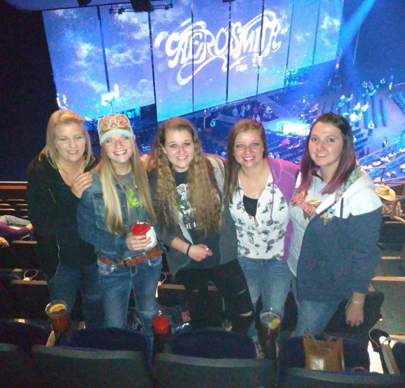
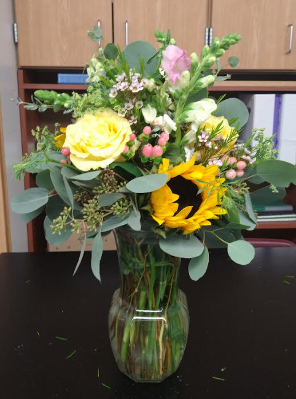
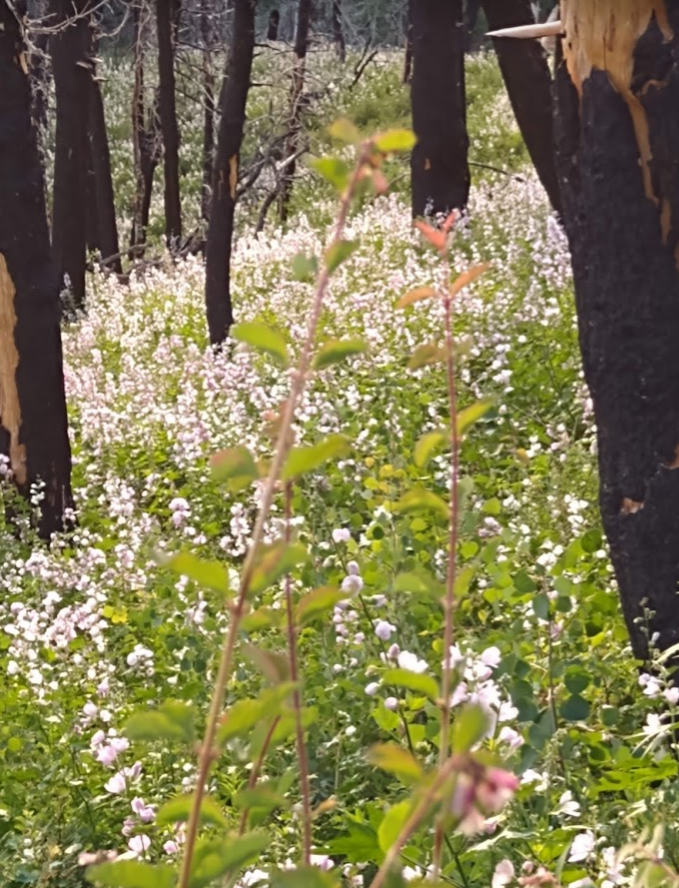
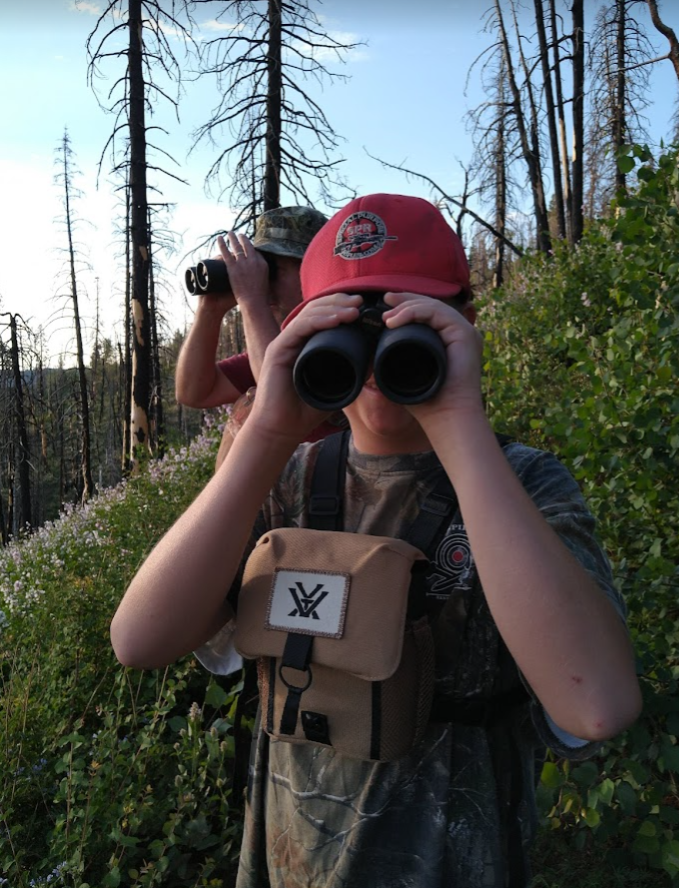
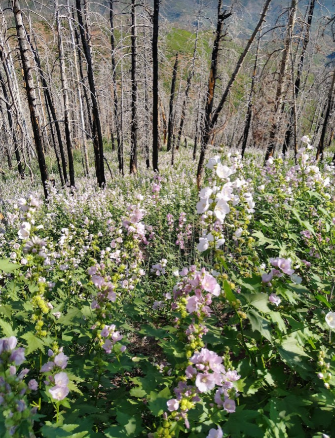

# About Me
```{r setup, include=FALSE}
knitr::opts_chunk$set(echo = FALSE, warning=FALSE, message=FALSE)
```

### Megan Frisby
- Microbiology student at Utah Valley University
- plant and animal enthusiast 
- Amateur data analyst 

#### Favorite Things:

1. Valais Blacknose Sheep - so adorable  

```{r sheep, out.width = "576", out.height="384"}
knitr::include_graphics(path = "../media/sheep.jpeg", )

```

2. Good books -- because why not?! 

```{r, out.height=576, out.width=384}
knitr:: include_graphics(path="../media/spillover.jpeg")
```

Slightly terrifying -- but still my favorite book ever


3. Nothing beats my homies -- except maybe a really, really good enchilada!

```{r, out.height=574, out.width = 500}

```

4. Floral design 

```{r, out.height=576, out.width = 489}
knitr::include_graphics(path = "../media/Screenshot 2023-03-27 11.27.38 AM.png")
```


```{r, out.height=600, out.width=385}

```

I spent at least 2 hours every day of the my senior year doing this, and I'd say it was worth every single rose thorn I had to dig out of my hands with a paper clip in the back of AP Physics!!


5. Adventure!!!

```{r, out.height=600, out.width=380}

```


```{r, out.height = 600, out.width=384}


```


```{r, out.height = 600, out.width=384}

```

Summer hike up Payson Canyon. How beautiful is our own backyard?!


### A quick coding sample 

here is the mpg data set:
```{r}
library(tidyverse)

mpg %>% kableExtra::kable() %>% kableExtra::kable_classic(lightable_options = 'hover') %>% 
  kableExtra::scroll_box(width="500px", height = "200px")


p <- mpg %>% ggplot(aes(x=displ, y=cty))+geom_point()+geom_smooth()
library(plotly)
ggplotly(p)


```


the mean cty miles per gallon is r `mean(mpg$cty)` in this data set 
```{r, comment=FALSE}
#use backtick left of one button 
```


